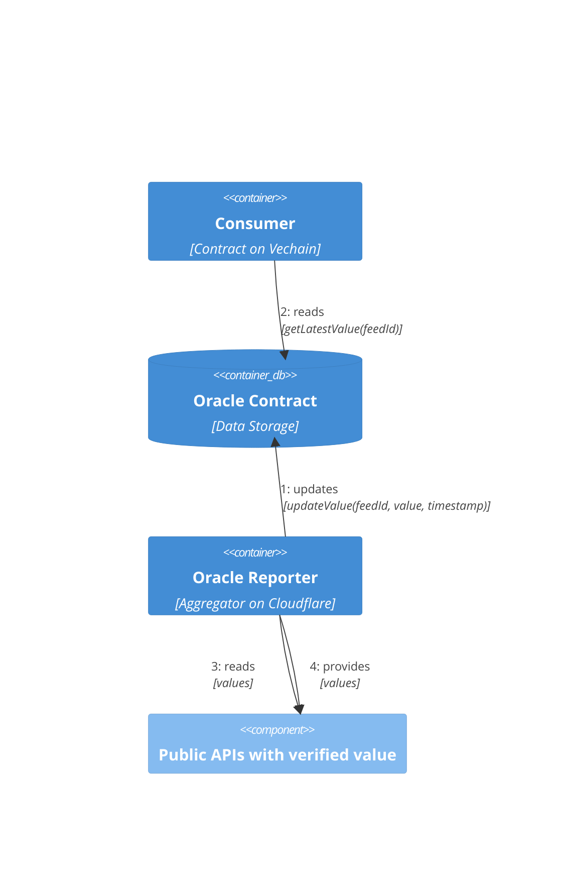
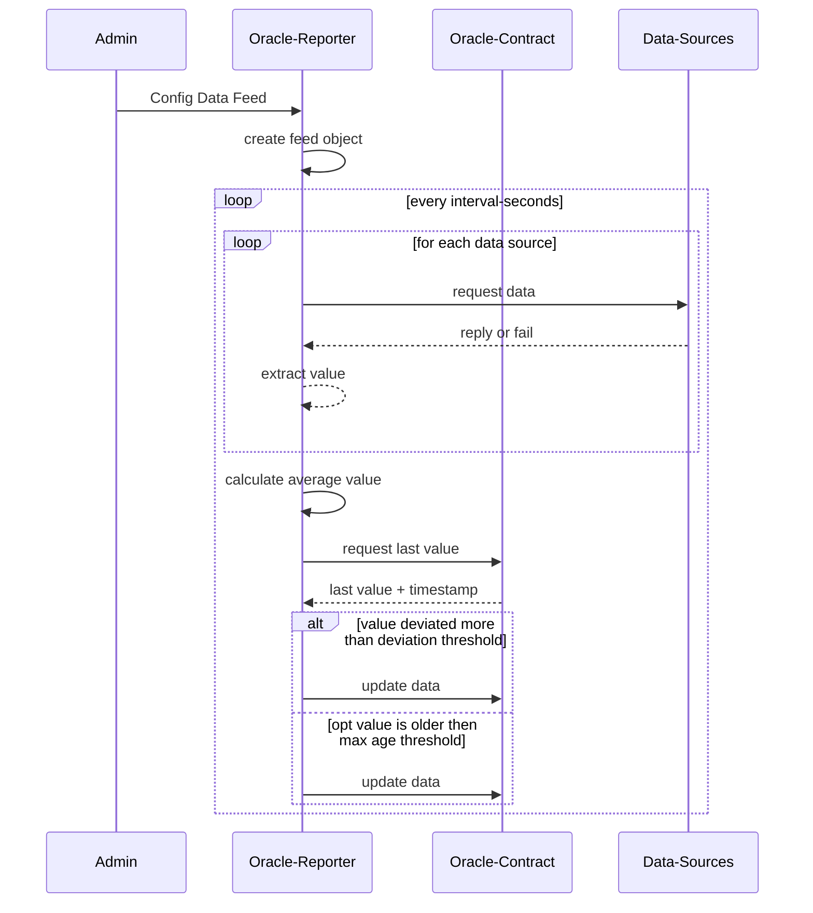

# oracle.vechain.energy

## Components

* [**contracts/**](./contracts/) contains contracts to manage the on-chain-storage.
   * It provides access to the latest known value
   * And allows verified users to update the data
* [**reporter/**](./reporter/) is a Cloudflare Worker that collects & reports new values to the on-chain-contracts
   * Is configurable with a JSON-Object, to support different sources and multiple feeds
   * Extracts a final value and stores it in a contract

## Processing Sequences

