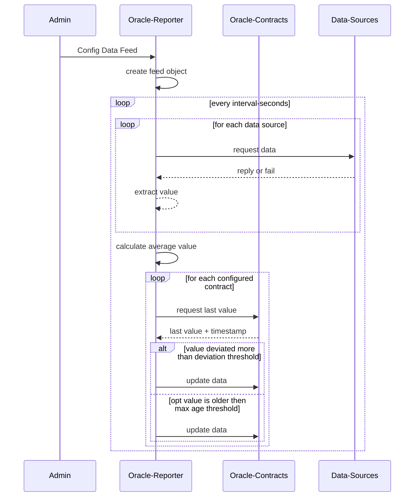

# oracle.vechain.energy

This project helps you create and operate oracle services on Vechain.

It includes smart contracts for storing data on-chain and a backend that updates this on-chain data. The oracle service can be customized to support various data sources and multiple feeds. It also offers a public API to get the most recent data from sources, even if it hasn't been stored on-chain yet.

## Components

* [**contracts/**](./contracts/) contains contracts to manage the on-chain-storage.
   * It provides access to the latest known value
   * And allows verified users to update the data
* [**reporter/**](./reporter/) is a Cloudflare Worker that collects & reports new values to the on-chain-contracts
   * Is configurable with a JSON-Object, to support different sources and multiple feeds
   * Extracts a final value and stores it in a contract
   * Provides a public API to access the latest value fetched from data sources, that has not been stored on-chain yet
     * as pure information for processing
     * and signed for verification in contracts
* [**example-consumers/**](./example-consumers/) contains sample snippets accessing the feed data
* [**statuspage/**](./statuspage/) contains html statuspage with a visualized health status
  * Also deployed on [status.oracle.vechain.energy](https://status.oracle.vechain.energy/).


## Processing Sequences




## Setting Up

### Storing Data

First, deploy an Oracle-Contract from the [contracts](./contracts) directory.

### Collecting Data

- Register on [Cloudflare](https://cloudflare.com), it will host the backend using [Cloudflare Workers](https://developers.cloudflare.com/workers/).
- Register on [vechain.energy](https://vechain.energy) and set up [API-Relay](https://docs.vechain.energy/vechain.energy/API-Keys/). Configure it to interact with everyone.
- Deploy the Reporter.
- Set up the Reporter with:
  - Access to your Oracle-Contract.
  - An API-Key for vechain.energy.
  - A secret API-Key for admin access.
- Identify your Data Sources and set up the Reporter with them.

### Accessing Data

- Use the Reporter-API to access data.
- Check out [Example Consumers](./example-consumers/) to learn different ways to use your data.


### Quick Start

```shell
# get a vechain.energy API-Key that can interact with everyone
VEN_API_KEY=""

# generate a new private key
PRIVATE_KEY="0x`openssl rand -hex 32`"

# generate an api key protecting your backend
API_KEY=`openssl rand -hex 32`

# deploy gas optimized contract
cd contracts
yarn install
yarn build
Compiled 22 Solidity files successfully (evm target: paris).

# deployer & reporter is the PRIVATE_KEY
PRIVATE_KEY="$PRIVATE_KEY" NETWORK=vechain yarn deploy OracleGasOptimized

Deploying to **TEST** network

ℹ [OracleGasOptimized] Artifact written to outputs/test/OracleGasOptimized.json
ℹ [OracleGasOptimized] Transaction Id: 0x18d4c4b0b4fc5a5dffd664a98c1ccbd03271badab84e157862e25ea61d95cd9e
✔ [OracleGasOptimized] Contract is now available at 0xf50d68918b8A63d113c6c329A893F6e9d3a4Bb30

# store oracle address in an environment variable
ORACLE_ADDRESS=`cat outputs/test/OracleGasOptimized.json | jq -r .address`
cd ..

# run a local development instance of the reporter
cd reporter

# configure secret vars for local environment
echo "PRIVATE_KEY=$PRIVATE_KEY" > .dev.vars
echo "API_KEY=$API_KEY" >> .dev.vars
echo "VEN_API_KEY=$VEN_API_KEY" >>  .dev.vars

# install dependencies
yarn install
cd ..

# store environment variables for later
echo "PRIVATE_KEY=$PRIVATE_KEY" > .env
echo "API_KEY=$API_KEY" >> .env
echo "VEN_API_KEY=$VEN_API_KEY" >>  .env
echo "ORACLE_ADDRESS=$ORACLE_ADDRESS" >>  .env

# the following command can restore the environment from .env file in the future:
set -o allexport; source .env; set +o allexport
```


Open second terminal to run the backend:
```shell
cd reporter

# run dev environment
# https://developers.cloudflare.com/workers/wrangler/install-and-update/
wrangler dev
 ⛅️ wrangler 3.19.0
-------------------------------------------------------
Using vars defined in .dev.vars
Your worker has access to the following bindings:
- Durable Objects:
  - ValueReporter: ValueReporter
- Vars:
  - PRIVATE_KEY: "(hidden)"
  - API_KEY: "(hidden)"
  - VEN_API_KEY: "(hidden)"
⎔ Starting local server...
[wrangler:inf] Ready on http://localhost:8787
```


Continue in first terminal with environment variables:

```shell
# setup data feed
curl -XPOST http://localhost:8787/vet-usd \
-H "X-API-Key: ${API_KEY}" \
-d '
{
    "id":"vet-usd",
    "sources": [
        {
            "url": "https://api.coincap.io/v2/assets/vechain",
            "path": ".data.priceUsd"
        }
    ],
    "heartbeat": 3600,
    "deviationPoints": 100,
    "interval": 60,
    "contracts": [{
        "nodeUrl": "https://node-testnet.vechain.energy",
        "address": "'"$ORACLE_ADDRESS"'"
    }]
}
'
```

```json
{"success":true,"id":"vet-usd"}
```

Checking the backend terminal, you'll see the first update been broadcast:

```shell
POST /vet-usd
vet-usd new configuration {
  id: 'vet-usd',
  heartbeat: 3600,
  deviationPoints: 100,
  interval: 60,
  contracts: [{
    nodeUrl: 'https://node-testnet.vechain.energy',
    address: '0xf50d68918b8A63d113c6c329A893F6e9d3a4Bb30'
  }],
  sources: [
    {
      url: 'https://api.coincap.io/v2/assets/vechain',
      path: '.data.priceUsd'
    }
  ]
}
vet-usd updating values
__fetched 0.0306102443635921 @ https://api.coincap.io/v2/assets/vechain .data.priceUsd
__fetched 0.0306102443635921 as average value
vet-usd last value: 30610244364n updatedAt 1702558104
age 1702558105 heartbeat 3600
vet-usd **updating**
vet-usd {"id":"0x87d077b7d7ca2921c56385fe725f01f721f05a83f2975627763caf46ba3e8ec9","url":"https://node-testnet.vechain.energy/transactions/0x87d077b7d7ca2921c56385fe725f01f721f05a83f2975627763caf46ba3e8ec9?pending=true"}
vet-usd sleeping till 2023-12-14T12:49:26.224Z
```

and every 60 seconds it will update the data:

```shell
[wrangler:inf] POST /vet-usd 200 OK (1579ms)
no config found in memory, loading from storage
vet-usd updating values
__fetched 0.030664445719926 @ https://api.coincap.io/v2/assets/vechain .data.priceUsd
__fetched 0.030664445719926 as average value
vet-usd last value: 30664445720n updatedAt 1702558166
age 63 heartbeat 3600
deviation 17 / 100
vet-usd not updating
vet-usd sleeping till 2023-12-14T12:50:27.491Z
```

**Check the contract on the Blockchain**

```shell
curl -s -XPOST "https://api.vechain.energy/v1/call/test" \
-H "content-type: application/json" \
-d '
{
  "clauses": [
    {
      "to": "'"$ORACLE_ADDRESS"'",
      "signature": "getLatestValue(bytes32 vet-usd) returns (uint128 value, uint128 timestamp)"
    }
  ],
  "encodeBytes": true
}
' | jq
```

```json
{
  "0": "30610244364",
  "1": "1702558104",
  "__length__": 2,
  "value": "30610244364",
  "timestamp": "1702558104"
}
```

**Check the Reporter status**

```shell
curl -s http://localhost:8787/vet-usd | jq
```

```json
{
  "id": "vet-usd",
  "interval": 60,
  "heartbeat": 3600,
  "deviationPoints": 100,
  "nextUpdate": null,
  "latestValue": {
    "id": "vet-usd",
    "value": "30610244364",
    "updatedAt": 1702558104,
    "formattedValue": "0.030610244364"
  }
}
```