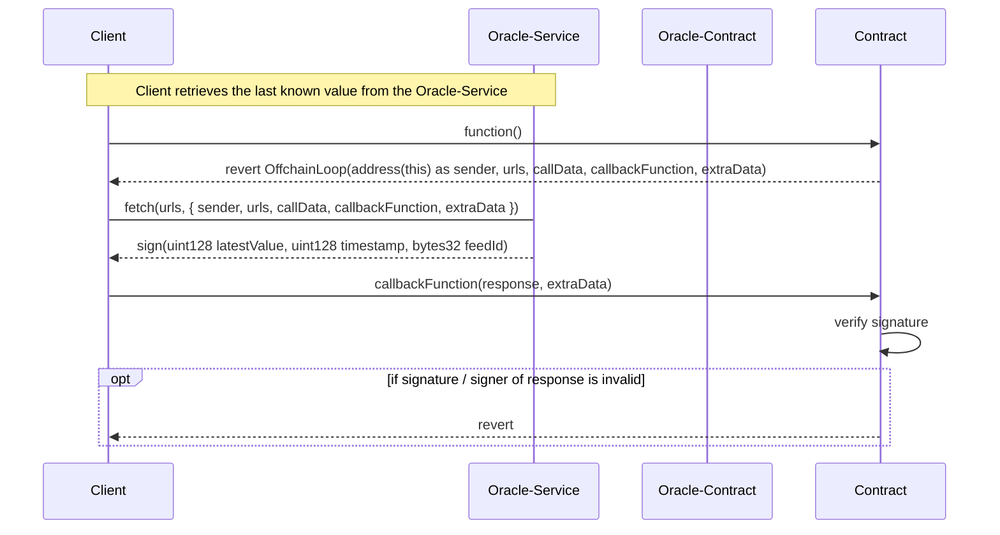

# Off-Chain-Data-Retrieval based on [ERC-3668](https://eips.ethereum.org/EIPS/eip-3668)

[`test-OracleCCIP.js`](./test-OracleCCIP.js) requires a deployment of [`OracleCCIP.sol`](./contracts/OracleCCIP.sol) to show an example off-chain-retrieval of information and verification in the contract. It is a complete flow compatible to CCIP Reading.


## Setup

```shell
yarn init -y
touch yarn.lock
yarn config set nodeLinker node-modules
yarn add ethers @chainlink/ethers-ccip-read-provider @vechain/web3-providers-connex @vechain/ connex-framework @vechain/connex-driver thor-devkit
```


## Run

```shell
# To test OracleCCIP.sol
node test-OracleCCIP.js <Deployment Address>
```


## Process

