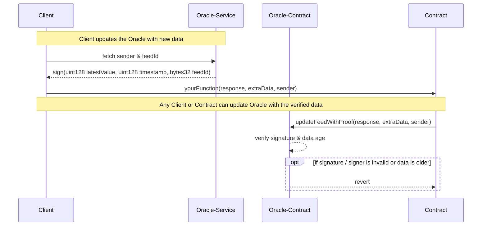

# Off-Chain-Data-Retrieval based on [ERC-3668](https://eips.ethereum.org/EIPS/eip-3668)

[`test-OraclePublicUpdater.js`](./test-OraclePublicUpdater.js) requires a deployment of [`OraclePublicUpdater.sol`](./contracts/OraclePublicUpdater.sol) to show an example off-chain-retrieval of information and updating feed data by any party. It leverages CCIP compatible output to allow everyone to update a feed using a verified input.


## Setup

```shell
yarn init -y
touch yarn.lock
yarn config set nodeLinker node-modules
yarn add ethers @vechain/web3-providers-connex @vechain/ connex-framework @vechain/connex-driver thor-devkit
```


## Run

```shell
# To test OraclePublicUpdater.sol
node test-OraclePublicUpdater.js <Deployment Address>
```


## Process

